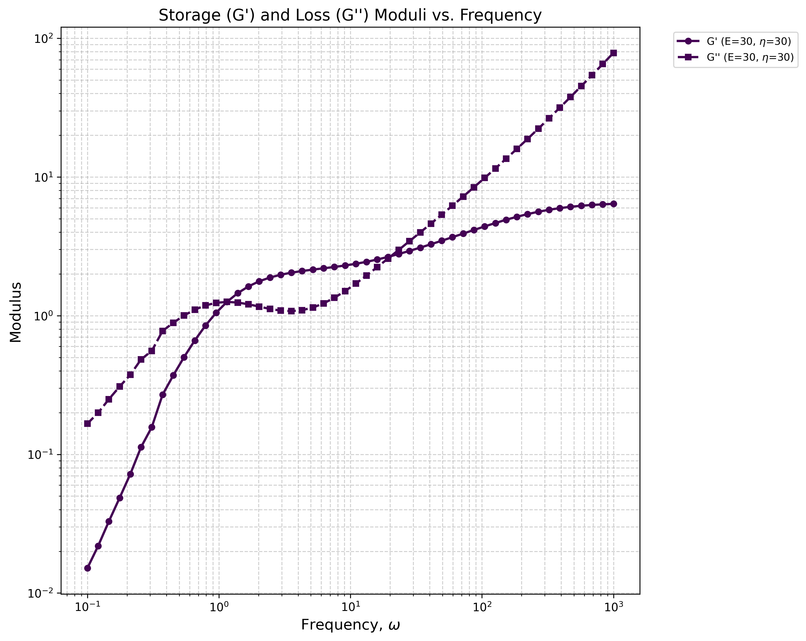
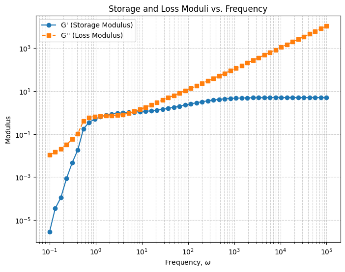
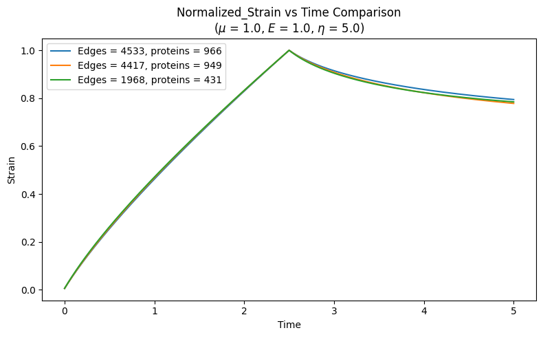

# Computational-Rheometry
# Description

This project numerically simulates the viscoelastic response of a molecular network using a computational rheometry method.

The system is represented as a network of nodes connected by Maxwell elements and immersed in a viscous Stokes fluid. The simulation uses regularized Stokeslets to calculate hydrodynamic interactions between the nodes.

The response of the network is studied using small amplitude oscillatory shear (SAOS), from which the storage modulus G'(ω) and loss modulus G''(ω) are calculated.

Features

- Maxwell element network
- Stokes fluid hydrodynamic interactions
- Regularized Stokeslet method
- Small amplitude oscillatory shear test
- Frequency sweep
- Storage modulus G'(ω)
- Loss modulus G''(ω)
- Complex shear modulus G*(ω)

# Simulated Physical System

The system consists of N nodes connected by Maxwell elements.

Each node is assigned an elastic modulus E and viscosity η. The network is immersed in an incompressible fluid with viscosity μ.

For a link between nodes i and j, the distance between the nodes is

rᵢⱼ = ||xⱼ − xᵢ||

The Maxwell element has a time dependent length ℓᵢⱼ and a resting length ℓᵢⱼ,0.

Its evolution is given by

dℓᵢⱼ/dt =
(Eℓᵢⱼ,0 / η)
(rᵢⱼ / ℓᵢⱼ − 1)

The elastic force between two connected nodes is

fᵢⱼ =
(Eℓᵢⱼ,0² / ℓᵢⱼ)
(rᵢⱼ / ℓᵢⱼ − 1)
(xⱼ − xᵢ) / rᵢⱼ

The total force on each node is the sum of the forces from its connected neighbors.

# Hydrodynamic Interactions

The surrounding fluid is described by the incompressible Stokes equations

μ∇²u − ∇p = −fϕδ(x − x₀)

∇ · u = 0

A regularized Stokeslet is used to calculate the velocity produced by the forces acting on the nodes.

The node velocities are obtained from the mobility matrix

u = (1 / μ) M g

where M contains the hydrodynamic interactions between all nodes.

# Small Amplitude Oscillatory Shear

One boundary of the network is fixed while the opposite boundary is driven with an oscillating velocity

uᵀᴬᴿᴳᴱᵀ = ε₀ω cos(ωt)eβ

The resulting shear stress is calculated from the forces acting on the driven boundary.

The storage and loss moduli are calculated as

G'(ω) =
ω / (πε₀)
∫ σ(t) sin(ωt) dt

G''(ω) =
ω / (πε₀)
∫ σ(t) cos(ωt) dt

# Results

The simulation produces the frequency dependent storage and loss moduli of the network.

The resulting G'(ω) and G''(ω) are used to study the elastic and viscous response of the system.

For a condensate system of two associative polymers with interaction strength 0.5 the results are shown below for E and η values as 30

done by considering right and left boundaries of thickness of 0.9% of the total length, keeping the left boundary fixed and moving the right boundary sinusoidally. This is a highly percolated system with approximately 25 degrees per node. The results show a double crossover which is different from the results obtained from Rouse Model simulations where only 1 crossover was observed, But Rouse model doesn't account for the hydrodynamic interactions while this methodology does.

The crossovers are highly dependent on the E, η and also the degree per nodes for the condensate which can be seen by the result below, which barely show a crossover for a degree per node of 9. 

For a creep test, Left side of the boundary was held fixed while stretching out the right boundary, for three different condensate systems the results are as shown where they are normalized to better compare them,

